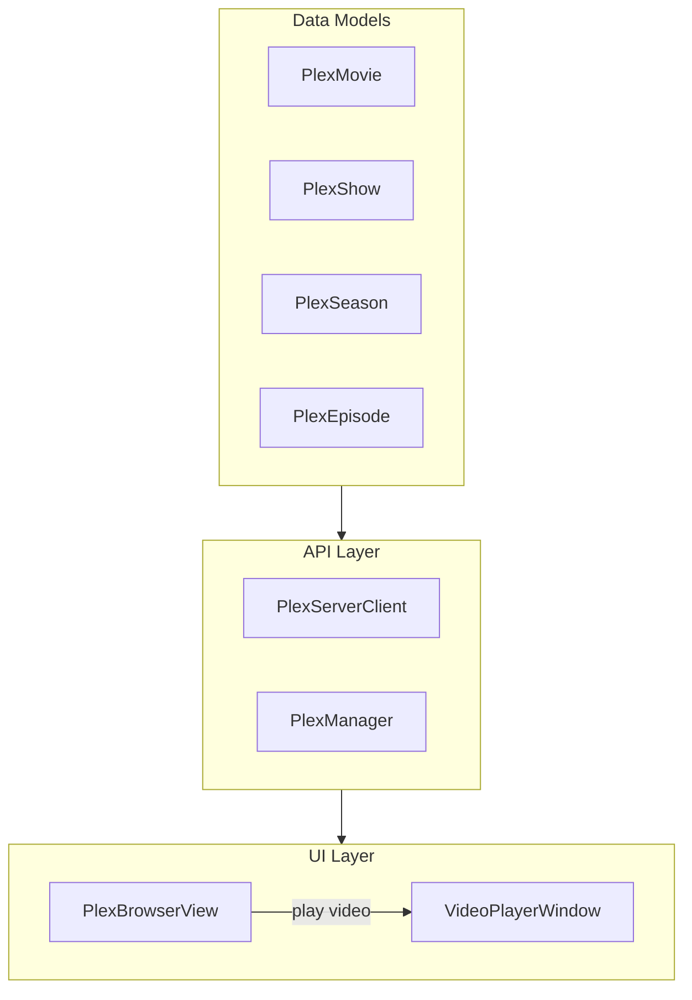

# Plex Video Support Plan

## Architecture Overview



## 1. Add Video Models

Update [`Sources/AdAmp/Data/Models/PlexModels.swift`](Sources/AdAmp/Data/Models/PlexModels.swift):

**Add library type helpers:**

```swift
extension PlexLibrary {
    var isMovieLibrary: Bool { type == "movie" }
    var isShowLibrary: Bool { type == "show" }
    var isVideoLibrary: Bool { isMovieLibrary || isShowLibrary }
}
```

**Add new model structs:**

- `PlexMovie` - id, title, year, summary, duration, thumb, art, contentRating, studio, media (reuse existing `PlexMedia`/`PlexPart`)
- `PlexShow` - id, title, year, summary, thumb, art, childCount (seasons), leafCount (episodes)
- `PlexSeason` - id, title, index (season number), parentTitle (show), thumb, leafCount (episodes)
- `PlexEpisode` - id, title, index (episode number), parentIndex (season), grandparentTitle (show), summary, duration, thumb, media

**Add DTOs and conversion methods** following the existing pattern (e.g., `PlexMetadataDTO.toMovie()`, `.toShow()`, etc.)

## 2. Update PlexServerClient

Update [`Sources/AdAmp/Plex/PlexServerClient.swift`](Sources/AdAmp/Plex/PlexServerClient.swift):

Add fetch methods mirroring the music API pattern:

- `fetchMovies(libraryID:offset:limit:)` - GET `/library/sections/{id}/all?type=1`
- `fetchShows(libraryID:offset:limit:)` - GET `/library/sections/{id}/all?type=2`
- `fetchSeasons(forShow:)` - GET `/library/metadata/{showId}/children`
- `fetchEpisodes(forSeason:)` - GET `/library/metadata/{seasonId}/children`
- `streamURL(for video: PlexMovie)` and `streamURL(for episode: PlexEpisode)` - same pattern as track streaming

Update `search()` to include movies/shows in results.

## 3. Update PlexManager

Update [`Sources/AdAmp/Plex/PlexManager.swift`](Sources/AdAmp/Plex/PlexManager.swift):

- Add `fetchMovies()`, `fetchShows()`, `fetchSeasons(forShow:)`, `fetchEpisodes(forSeason:)` convenience methods
- Add `convertToVideoURL(_ movie: PlexMovie) -> URL?` and similar for episodes
- Update `availableLibraries` to include video libraries (currently filters to music only)

## 4. Update PlexBrowserView

Update [`Sources/AdAmp/Windows/PlexBrowser/PlexBrowserView.swift`](Sources/AdAmp/Windows/PlexBrowser/PlexBrowserView.swift):

**Add browse modes:**

```swift
enum PlexBrowseMode: Int, CaseIterable {
    case artists = 0, albums, tracks, search, movies, shows
}
```

**Add display item types:**

```swift
enum PlexDisplayItemType {
    // existing...
    case movie(PlexMovie)
    case show(PlexShow)
    case season(PlexSeason)
    case episode(PlexEpisode)
}
```

**Update `loadDataForCurrentMode()`** to handle `.movies` and `.shows` tabs.

**Update click handlers** to play videos via the new VideoPlayerWindow.

**Conditionally show tabs** based on available library types (music vs video).

## 5. Create VideoPlayerWindow

Create new files in `Sources/AdAmp/Windows/VideoPlayer/`:

**VideoPlayerWindowController.swift:**

- NSWindowController subclass
- Resizable, titled window with standard controls
- Close on escape, toggle fullscreen on double-click

**VideoPlayerView.swift:**

- Use `AVPlayerView` from AVKit for native video controls
- Accept a URL and title to play
- Handle play/pause, seek, volume
- Show loading indicator while buffering

**Key implementation:**

```swift
import AVKit

class VideoPlayerView: NSView {
    private var playerView: AVPlayerView!
    private var player: AVPlayer?
    
    func play(url: URL, title: String) {
        player = AVPlayer(url: url)
        playerView.player = player
        player?.play()
    }
}
```

## 6. Integration Points

**WindowManager** ([`Sources/AdAmp/App/WindowManager.swift`](Sources/AdAmp/App/WindowManager.swift)):

- Add `videoPlayerWindowController: VideoPlayerWindowController?`
- Add `showVideoPlayer(url: URL, title: String)`

**ContextMenuBuilder** ([`Sources/AdAmp/App/ContextMenuBuilder.swift`](Sources/AdAmp/App/ContextMenuBuilder.swift)):

- Video libraries will appear automatically once PlexManager exposes them

## File Summary

| File | Action |

|------|--------|

| `PlexModels.swift` | Add PlexMovie, PlexShow, PlexSeason, PlexEpisode |

| `PlexServerClient.swift` | Add video fetch methods |

| `PlexManager.swift` | Add video convenience methods |

| `PlexBrowserView.swift` | Add movies/shows tabs and playback |

| `VideoPlayerWindowController.swift` | New file |

| `VideoPlayerView.swift` | New file |

| `WindowManager.swift` | Add video player management |